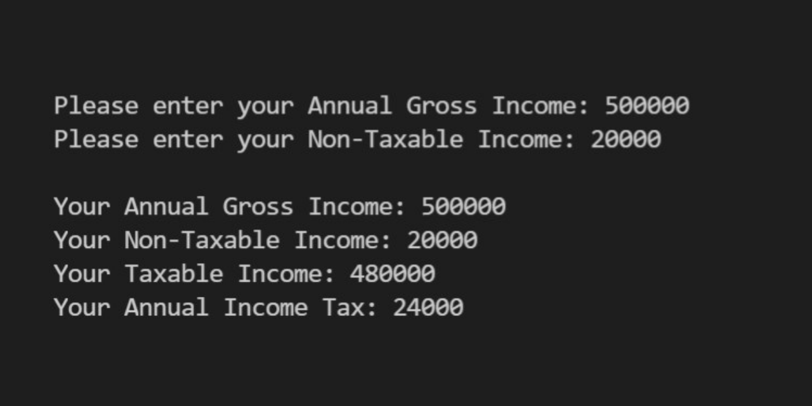

# Indonesian Payroll Tax Calculation using Java Programming Language
This is the project of the Object-Oriented and Visual Programming course. This project aims to do an Indonesian payroll tax calculation with an object-oriented programming concept (abstraction and encapsulation) using the Java programming language. 

The program accepts the annual gross income and non-taxable income from the user then, it will process the taxable income and calculates income tax from the user input and the result will show the annual gross income, non-taxable income, taxable income, and income tax, to run the program, you may run the main program it is IT001202000101.java.

